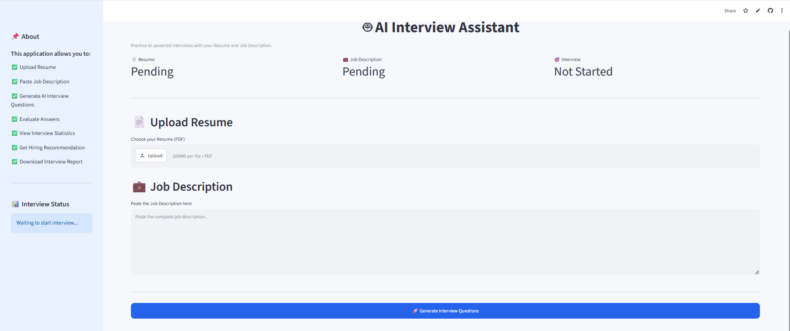
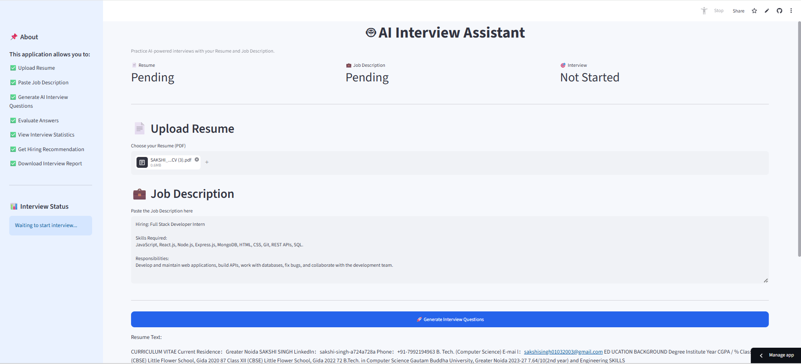
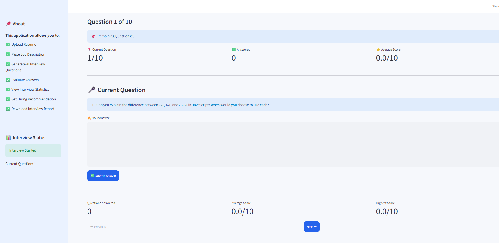
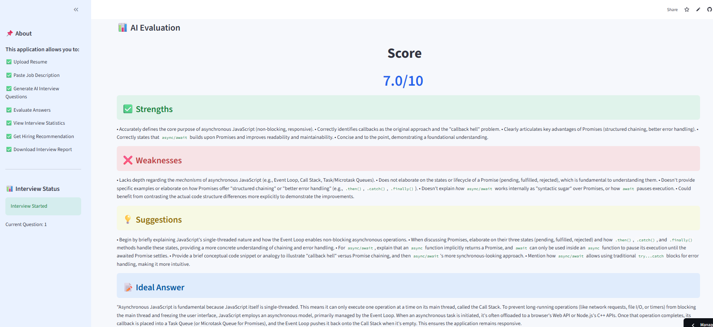
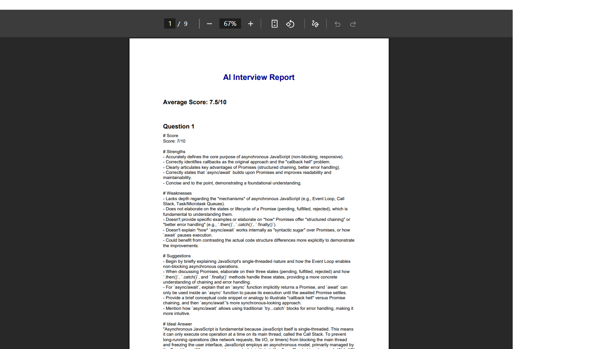

# 🤖 AI Interview Assistant

An AI-powered Interview Preparation Platform built using **Python**, **Streamlit**, and **Google Gemini AI**. This application generates personalized interview questions from a candidate's resume and a job description, evaluates answers using AI, provides detailed feedback, and generates a downloadable interview report.

---

## 🚀 Features

- 📄 Upload Resume (PDF)
- 💼 Paste Job Description
- 🤖 AI-generated Interview Questions
- ✍️ Answer Questions in Real-Time
- 📊 AI-based Evaluation & Scoring
- ✅ Strengths & Weaknesses Analysis
- 💡 Improvement Suggestions
- 📝 Ideal Answer Generation
- 📈 Performance Analytics Dashboard
- 📉 Score Trends & Charts
- 📄 Download Interview Report (PDF)
- 🔄 Restart Interview Anytime

---

## 🛠️ Tech Stack

### Frontend
- Streamlit

### Backend
- Python

### AI Model
- Google Gemini API

### Libraries Used
- Streamlit
- Google Generative AI
- PyPDF2
- ReportLab
- Pandas
- python-dotenv

---

## 📂 Project Structure

```text
AI-Interview-Assistant/
│
├── app.py
├── interview_ai.py
├── resume_parser.py
├── pdf_generator.py
├── requirements.txt
├── README.md
├── .gitignore
└── .env (Not uploaded)
```

---

## ⚙️ Installation

Clone the repository:

```bash
git clone https://github.com/SakshiSingh0103/AI-Interview-Assistant.git
```

Move into the project folder:

```bash
cd AI-Interview-Assistant
```

Create a virtual environment:

```bash
python -m venv .venv
```

Activate the virtual environment:

### Windows

```bash
.venv\Scripts\activate
```

Install dependencies:

```bash
pip install -r requirements.txt
```

---

## 🔑 Environment Variables

Create a `.env` file in the project folder.

```env
GEMINI_API_KEY=YOUR_GEMINI_API_KEY
```

---

## ▶️ Run the Application

```bash
streamlit run app.py
```

---

## 📊 Application Workflow

1. Upload Resume
2. Paste Job Description
3. Generate AI Interview Questions
4. Answer Questions
5. Receive AI Evaluation
6. View Performance Dashboard
7. Download Interview Report

---

## 📸 Screenshots

## 📸 Application Preview

### 🏠 Home Page



---

### 📄 Resume Upload



---

### 🎤 Interview Question



---

### 📊 AI Feedback



---

### 📈 Performance Dashboard


---

### 📄 PDF Report



## 🌟 Future Improvements

- 🎤 Voice-based Interviews
- 🎥 Video Interview Support
- 📚 Multiple Interview Domains
- 🌍 Multi-language Support
- ☁️ Cloud Database
- 📈 Interview History

---

## 👩‍💻 Author

**Sakshi Singh**

B.Tech Computer Science Engineering

Gautam Buddha University

GitHub:
https://github.com/SakshiSingh0103

---

## 📜 License

This project is developed for educational and portfolio purposes.